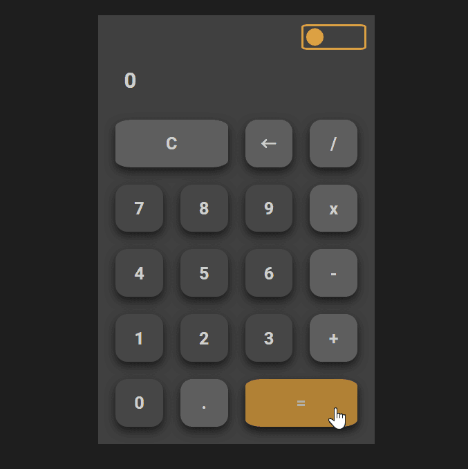
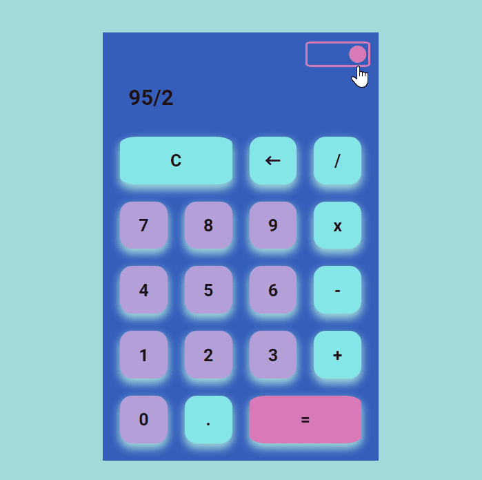

# Calculadora con JS

## Descripcion
Este proyecto es una calculadora básica hecha con HTML, CSS y JS. La calculadora tiene las funcionalidades básicas de una calculadora, como suma, resta, multiplicación y división.

Para este proyecto, se utilizaron clases en JS para el funcionamiento de la calculadora para organizar y encapsular el codigo facilmente. La calculadora tiene una interfaz simple y fácil de usar. El usuario puede hacer clic en los botones numéricos y de operación para ingresar números y realizar operaciones. 

## Despliegue 
https://soyrandy708.github.io/Calculadora-JS/

     

